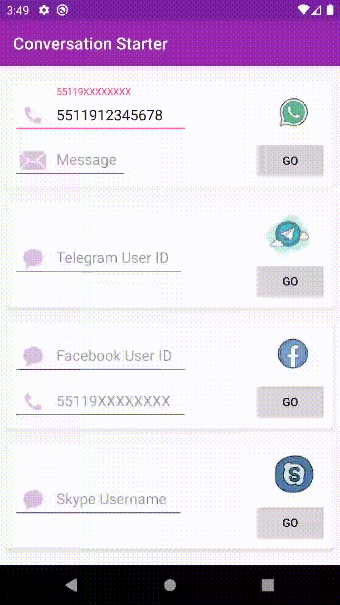

# Conversation Starter [](https://travis-ci.com/lalbuquerque/conversation-starter) [  ](https://bintray.com/lalbuquerque/maven/com.github.lalbuquerque.pipa%3Aconversation-starter/_latestVersion)

To add this library to your app, first you need to add this to your root `build.gradle`:

```
repositories {  
    maven { url  "https://dl.bintray.com/lalbuquerque/maven" }  
}
```

and this to the `build.gradle` of your module:

```
implementation 'com.github.lalbuquerque.pipa:conversation-starter:0.0.4'
```


To start a conversation, you just need to choose between the 4 supported Messengers methods
```
 goToWhatsAppMessageView (...)
 goToTelegramMessageView (...)
 goToFacebookMessageView (...)
 goToSkypeMessageView (...)
```

and call it informing the required arguments:

```kotlin
try {
    ConversationStarter().goToTelegramMessageView(context, userId = "tecnoblog")
} catch (e: Exception) {
    e.printStackTrace()
} 
```

When you have the specific Messenger app installed in your device you should see something like this:


Otherwise if you don't have that Messenger app installed, you'll see this:

